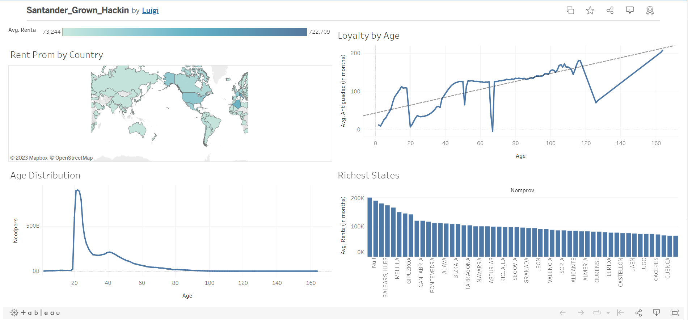

# 30-Day Data Science Challenge Repository
Welcome to my 30-day data science challenge repository! Here, I will be sharing the projects that I complete as part of Avery Smith's 30-day data science challenge, where I aim to complete 30 data science projects in 30 days. Each project will focus on a different topic or technique, and will showcase my skills in data analysis, machine learning, and data visualization. The projects will be a combination of python, SQL, Tableau and Power BI. This repository will be updated daily with new projects and their respective code, visualizations and data sets. Feel free to take a look around, and let me know if you have any questions or feedback!

## Project List
Day 1: Analyzing Animal Shelter Data with Dash
Day 2: Who is The Most Googled Man? Animated Line Chart + Google Trends
Day 3: Beginner Data Visualization Project using Observe, Collect, Draw
Day 4: NFT Data Analytics Project With Python
Day 5: Visualize LinkedIn Data with Tableau
Day 6: Make a Word Cloud with an Image (The Office)
Day 7: Created AI Generated Art
Day 8: Using R to Analyze if Survivor is Racist
Day 9: NBA Lineup Analysis with Python + Streamlit
Day 10: AirBnb Analysis with SQL
Day 11: Google Analytics with Keboola & Google Data Studio
Day 12: Horse Racing Data Science Project in 30 Minutes (Kaggle Project)
Day 13: Strava Data in Power BI
Day 14: Automate LinkedIn with Python
Day 15: Coding a Data Science Project using ONLY my phone
Day 16: The Only Data Analyst Portfolio Project You Need (Amazon)
Day 17: Data Scientist Machine Learning Project | HR Analytics
Day 18: Weekly Community Data Science Projects (Tidy Tuesday)
Day 19: Visualizing Elon Musk Tweets in Augmented Reality
Day 20: Beginner NLP Data Science Project with Python
Day 21: I Analyzed Ken Jee's Data Better Than He Did
Day 22: Engineering Data Analysis (PCA)
Day 23: Easy Bar Chart Race Animation Tutorial
Day 24: Regression in R to Analyze Health Data
Day 25: Gun Background Checks in USA in Tableau
Day 26: How I’d Use Data Science To Launch a Business
Day 27: Implementing Data Quality in Python w/ Great Expectations
Day 28: Using Data Science to UNCOVER McDonald’s Healthiest Food
Day 29: Using Python to Create Image Filters
Day 30: NFL Big Data Bowl - Special Teams

## Tools
- Python
- SQL
- Tableau
- Power BI

## Screenshots

## Installation
1. Clone the repository
git clone https://github.com/username/30-day-data-science-challenge.git
